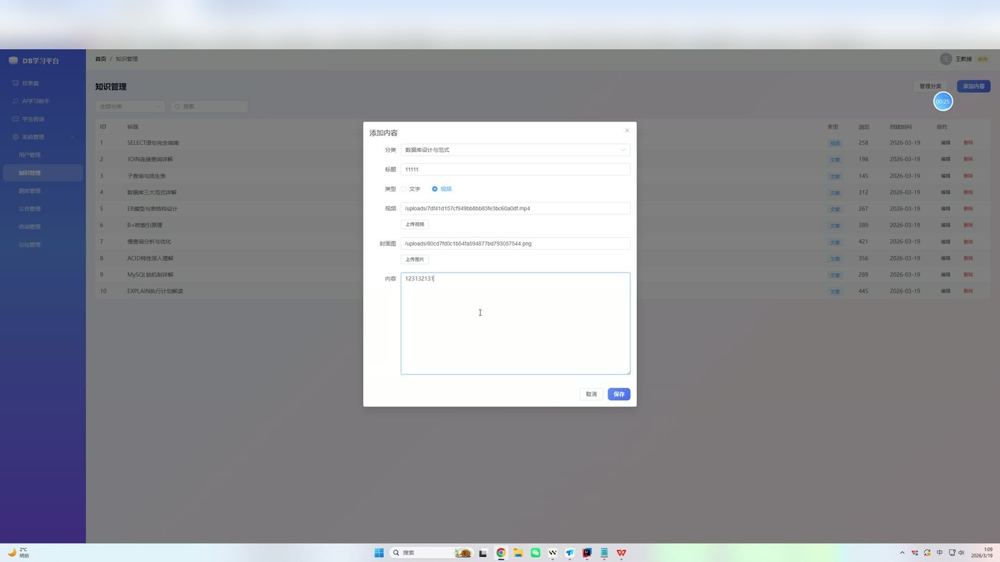
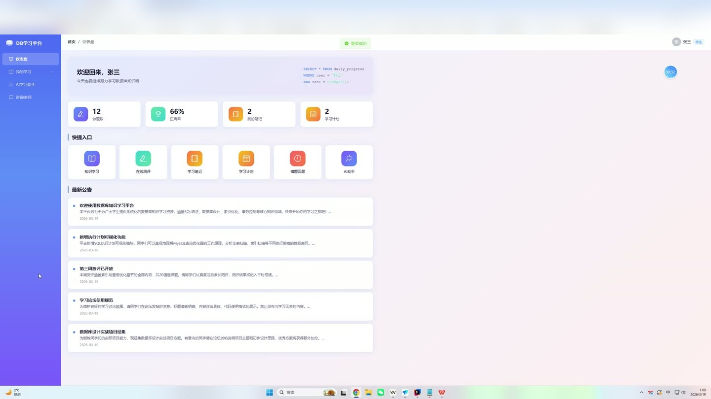
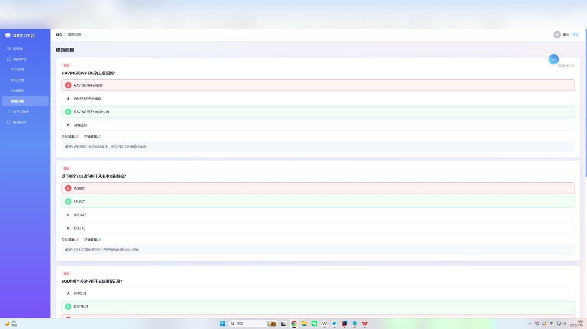

# (附文档)Springboot3+Vue3+MySQL 数据库知识学习平台

**技术栈**：Springboot3、Vue3、PostgreSQL

### 系统简介

本系统是一个基于 Spring Boot 3 + Vue 3 + PostgreSQL 的数据库知识学习平台，采用前后端分离架构。平台支持学生、教师两种角色，提供知识内容学习、在线测评、AI 智能问答、学习笔记与计划管理、论坛交流、咨询答疑、错题回顾等完整的学习闭环功能，同时为教师提供用户管理、知识管理、题库管理、公告管理、咨询管理及论坛管理等后台管理能力。
 
### 核心功能
 
### 普通用户端

 
- 浏览首页仪表盘，查看知识分类、最新知识内容、平台公告及平台统计数据（用户数、知识数、分类数）。 
- 按分类或关键词搜索知识内容列表，支持分页浏览，点击进入详情页查看完整内容（含富文本/视频/封面图）。 
- 在知识详情页自动增加内容浏览量（viewCount），记录学习轨迹。 
- 创建、编辑、删除个人学习笔记，支持设置是否公开分享（isShared 字段），公开笔记按点赞数排序展示。 
- 为公开的学习笔记点赞（likeCount +1），浏览其他用户分享的精华笔记列表。 
- 创建个人学习计划，填写标题、描述、起止日期、状态及进度百分比，支持分页查看与删除。 
- 按分类和难度筛选试题进行在线自测，提交答案后系统自动判分并返回总分、正确题数及得分百分比。 
- 查看个人答题历史中的错题记录（isCorrect=0），支持分页回顾并分析错误原因。 
- 查看个人答题统计数据，包括总答题数、正确数及正确率。 
- 通过 AI 学习助手输入数据库相关问题，系统调用 DeepSeek API 返回专业解答（含 SQL 示例），未配置 API Key 时自动使用内置离线知识库回答。 
- 发起咨询（标题+内容），系统自动创建咨询记录并生成初始消息，支持查看咨询详情及历史消息列表。 
- 在咨询会话中发送消息（角色为 student），消息自动更新咨询状态为 pending。 
- 查看教师回复后的咨询记录（状态为 replied），支持分页查看本人发起的全部咨询。 
- 在论坛中浏览所有帖子列表（支持按标题关键词搜索），点击进入详情页查看帖子完整内容及回复列表。 
- 在帖子详情页自动增加浏览量（viewCount），查看帖子的所有回复（按时间正序排列）。 
- 发布新论坛帖子（标题+内容），自动设置发帖人 ID、初始浏览量和回复数。 
- 对已有帖子进行回复，回复后帖子回复数（replyCount）自动 +1。 
- 查看平台发布的公告列表（仅显示 status=1 的已发布公告），按时间倒序排列。 
- 在个人中心查看和修改个人信息（用户名、昵称、头像、邮箱），修改登录密码（需验证原密码）。 
- 上传文件（头像/图片/附件），系统自动生成唯一文件名并保存至上传目录。
 
### 管理员端

 
- 查看系统仪表盘，获取用户数、知识内容数、知识分类数等统计数据。 
- 管理用户账号：查看用户列表（支持按昵称/用户名搜索）、新增用户、编辑用户信息、启用/禁用账号（切换 status 状态）、删除用户。 
- 管理知识分类：新增、编辑、删除分类（名称、描述、封面图、排序号），分类列表按 sortOrder 升序排列。 
- 管理知识内容：新增/编辑知识条目（选择分类、填写标题、正文内容、内容类型、视频链接、封面图），支持按分类和关键词筛选，可删除内容。 
- 管理题库：新增、编辑、删除试题（题目文本、四个选项 A/B/C/D、正确答案、解析、难度等级、关联分类），支持按分类筛选查看。 
- 管理平台公告：发布、编辑、删除公告（标题、正文、发布状态），公告列表按创建时间倒序排列。 
- 管理所有咨询记录：查看全部咨询列表（不分角色），查看每条咨询的详细消息对话，可回复咨询并自动更新状态为 replied。 
- 管理论坛帖子：查看全部帖子列表，删除违规帖子（同时级联删除该帖下的所有回复）。 
- 以教师身份回复学生咨询时，发送消息的角色为 teacher，咨询状态自动变为 replied。
 
### 技术栈

 后端框架Spring Boot 3.x ORM 框架MyBatis-Plus 权限认证JWT（jjwt） 前端框架Vue 3（Composition API） 状态管理Pinia 路由管理Vue Router 4（History 模式） UI 组件库Element Plus 构建工具Vite 数据库PostgreSQL（兼容 MySQL 方言） HTTP 客户端Axios（前端请求拦截器） AI 集成DeepSeek API（REST 调用） 文件上传MultipartFile + 本地存储 跨域处理全局 CORS 配置
 
### 交付内容

 
- 后端完整源码 
- 前端完整源码 
- 数据库初始化脚本 
- 万字文档

## 界面展示

---

## 获取完整源码 + 万字文档

本仓库为项目介绍页。**完整前后端源码、数据库初始化脚本、万字项目文档**，请加微信 `kangkangcode`，或访问 [codekk.top](http://codekk.top) 获取。

可作课程设计 / 毕业设计参考，支持远程部署调试。